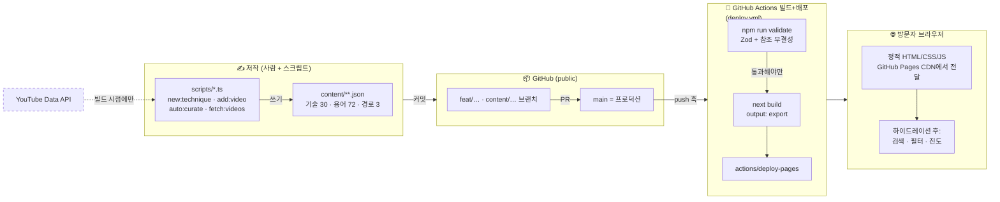
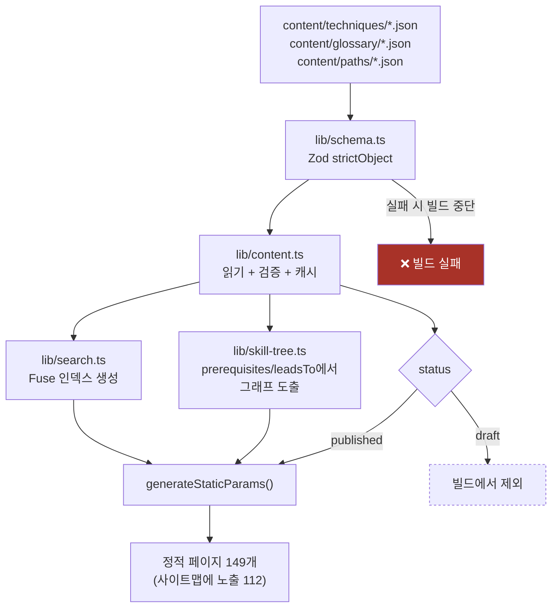
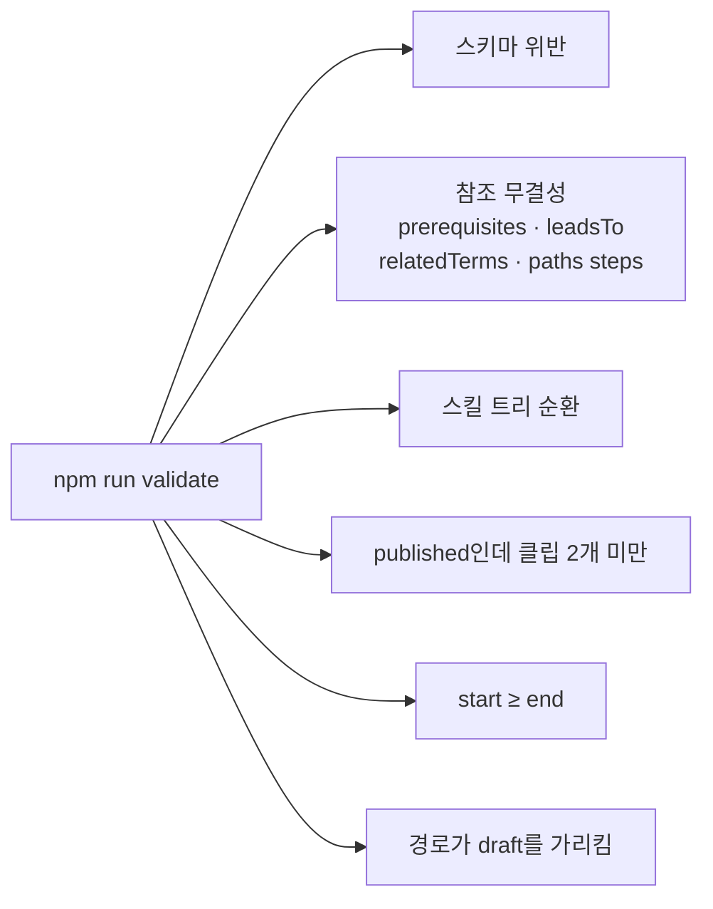
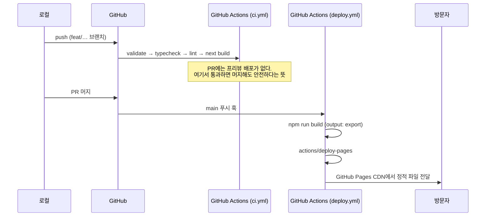
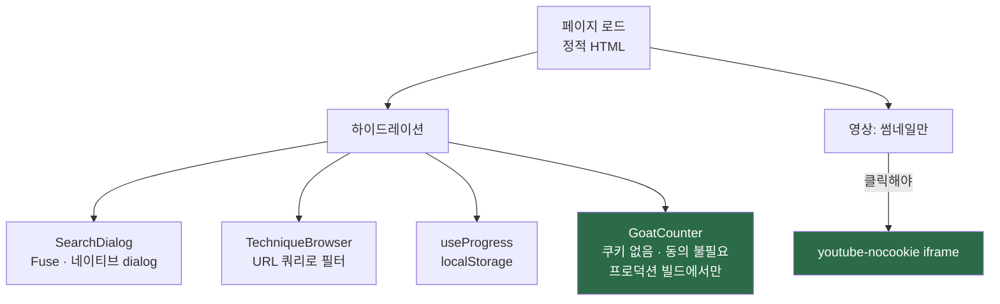
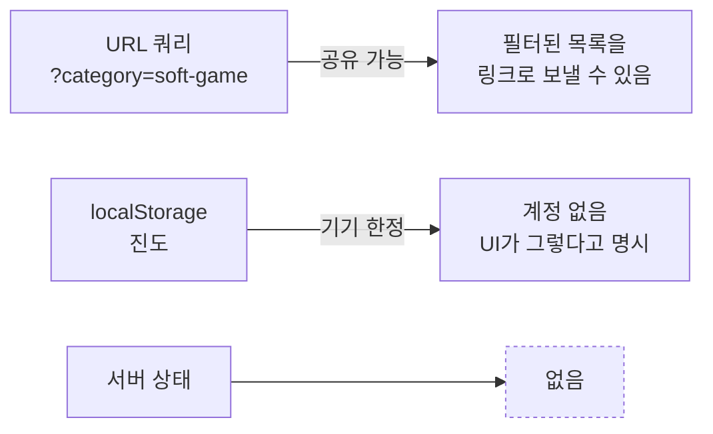
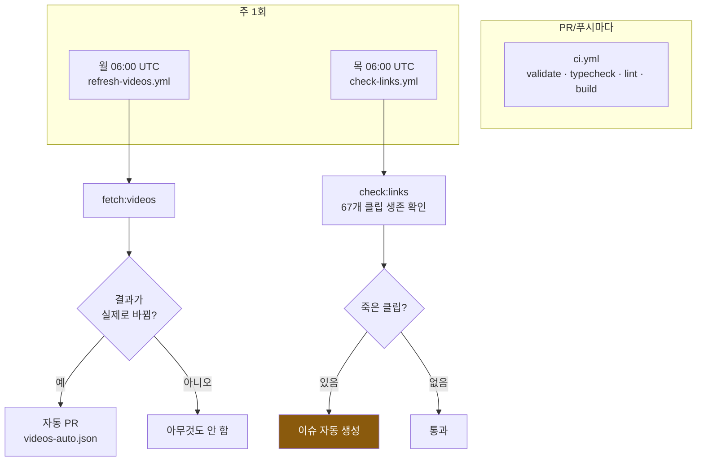
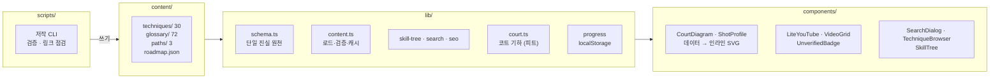

# 아키텍처

이 사이트가 **어떻게 배포되고 어떻게 돌아가는지**를 한 장에 담는다.
무엇을 만드는지는 `REQUIREMENTS.md`, 어떤 순서로 만드는지는 `DEVELOPMENT_PLAN.md`.

---

## 0. 한 문장 요약

> **DB가 없다.** 콘텐츠는 레포 안의 JSON이고, git이 CMS이며, 모든 페이지는
> 빌드 시점에 정적으로 찍힌다. 런타임에 살아 있는 서버 로직은 **없다.**

이 한 문장에서 나머지가 거의 다 파생된다 — 왜 YouTube API를 런타임에 안 부르는지,
왜 콘텐츠 오류가 빌드를 깨야 하는지, 왜 진도 저장이 localStorage인지.

---

## 1. 전체 그림



**점선이 핵심이다.** YouTube API는 저작 스크립트에서만 호출되고, 그 결과는
JSON으로 커밋된다. 방문자의 브라우저도, 배포된 서버도 YouTube API를 부르지 않는다.

---

## 2. 콘텐츠가 페이지가 되기까지



### 왜 이렇게 했나

| 결정 | 이유 |
|---|---|
| **Zod `strictObject`** | 스키마에 없는 필드가 있으면 빌드가 깨진다. 오타 난 키가 조용히 무시되지 않는다 |
| **`draft` 제외** | 반쯤 쓴 기술도 안전하게 커밋할 수 있다. `next dev`에서는 보이고 프로덕션 빌드에서만 빠진다 |
| **그래프를 도출** | 스킬 트리용 별도 파일이 없다. 단일 진실 원천은 기술 파일의 `prerequisites`/`leadsTo` |
| **검색 인덱스도 빌드 시점** | 코퍼스가 100여 건이라 통째로 실어 보내는 편이 왕복보다 빠르다 |

### `validate`가 잡는 것



`npm run build`는 `validate && next build`다. **검증이 빌드의 관문이고**, CI와
배포 워크플로우(`deploy.yml`)가 같은 명령을 쓰므로 로컬에서 통과한 것만 배포된다.

---

## 3. 배포



### 환경변수

| 변수 | 어디에 | 없으면 |
|---|---|---|
| `YOUTUBE_API_KEY` | 로컬 `.env.local`, GitHub Secrets | 저작 스크립트만 못 씀. **빌드에는 불필요** |
| `NEXT_PUBLIC_SITE_URL` | (미설정) | `https://sehyunnoh.github.io/pickleball`로 폴백 (커스텀 도메인 붙을 때만 설정) |
| `NEXT_PUBLIC_CONTACT_EMAIL` | (미설정) | About·Privacy의 문의 섹션이 숨겨짐 |

> `NEXT_PUBLIC_*`은 **빌드 시점에 번들에 문자열로 박힌다.** 값만 바꾸고 재배포하지
> 않으면 아무 일도 일어나지 않는다.

---

## 4. 브라우저에서 실제로 도는 것

정적 HTML이 먼저 그려지고, 하이드레이션 이후에만 아래가 붙는다.



### 파사드

무거운 제3자는 하나 남았고, 원칙은 그대로다 — 누르기 전엔 연결하지 않는다.

| | 막는 것 | 푸는 조건 |
|---|---|---|
| `LiteYouTube` | YouTube iframe (수 MB) | 재생 버튼 클릭 |

애널리틱스는 세 번째 벤더를 쓰고 있다. **GA4(~2026-09-17) → Vercel Web
Analytics(2026-09-17~2026-09-25) → 이틀간 없음 → GoatCounter(2026-09-27~).**
Vercel Web Analytics는 Vercel 배포에서만 스크립트가 서빙되는 구조라 GitHub
Pages로는 그대로 들고 올 수 없었다. 대체 없이 며칠 두어봤지만, "어떤 기술을
사람들이 실제로 읽는지"를 알 방법이 아예 없어지는 게 아쉬워 GoatCounter로
채워 넣었다 — 오픈소스에 쿠키·식별자를 안 쓴다는 조건은 그대로 지키는 대안.

지금도 쿠키나 영속 식별자는 없다. 방문자는 IP+브라우저를 그날 하루짜리 해시로
묶어 "새 방문인가"만 구분하고, 그 해시 자체는 저장되지 않는다 — 남는 건 경로·
리퍼러·국가·브라우저·OS의 집계뿐이다. 그래서 동의 바가 없고,
`ConsentBanner`·`ConsentControl`·`lib/consent.ts`도 진작에 삭제된 채다. 광고를
붙이는 날에는 인증 CMP와 함께 동의 질문이 돌아온다 — 광고 쿠키는 물어봐야 하는
쪽이기 때문이다.

### 상태는 어디에 사는가



---

## 5. 자동화 (GitHub Actions)



`refresh-videos`가 `fetchedAt`만 바뀐 경우를 걸러내는 이유: 매주 "아무 내용 없는 PR"이
열리면 아무도 그 PR을 읽지 않게 된다.

---

## 6. 디렉터리와 책임



### 다이어그램은 그림이 아니라 데이터다

`lib/court.ts`가 코트 기하를 **피트 단위**로 들고 있고, 기술·드릴 JSON은
`[가로, 세로]` 좌표를 담는다 (가로 0–20, 세로 0=내 베이스라인 … 44=상대 베이스라인).
컴포넌트가 그걸 인라인 SVG로 렌더한다. 차트 라이브러리는 없다.

역할 분담이 의도적이다:

| | 보여주는 것 |
|---|---|
| **다이어그램** | 위치와 궤적 |
| **영상** | 몸의 동작 |

다이어그램으로 패들 각도나 무릎 굽힘을 그리려 하지 않는다. 그건 클립이 할 일이다.

---

## 7. 지금 상태

```
30 기술 (전부 published) · 72 용어 · 3 경로 · 67 클립
정적 페이지 149개 (사이트맵 112 URL) · P0 19/19
Lighthouse 모바일 96 / 92 / 98 · 접근성 100
```

**남은 한 가지: 클립 67개 중 47개가 `verified: false`다.** 제목 매칭으로 채운
것들이고, 페이지에 **Unverified** 라벨이 붙어 그 사실을 밝힌다. 이걸 타임스탬프가
있는 것으로 교체하는 게 남은 작업의 전부이며, 사람이 영상을 봐야 하는 일이다.
순서는 `docs/CURATION.md`가 관리한다.

---

## 8. 자주 부딪히는 것

| 증상 | 원인 |
|---|---|
| 콘텐츠를 고쳤는데 빌드가 깨짐 | `validate`가 관문이다. 메시지가 파일과 필드를 지목한다 |
| 새 기술이 사이트에 안 보임 | `status: "draft"`이거나 클립이 2개 미만 |
| 환경변수를 바꿨는데 그대로 | `NEXT_PUBLIC_*`은 빌드에 박힌다. **재배포 필요** |
| 배포가 안 됨 | Settings → Pages에서 Source가 "GitHub Actions"인지 확인. `deploy.yml`이 main 푸시에서 실행됐는지 Actions 탭 확인 |
| `next dev`에서 필터가 안 먹힘 | 스트리밍이 두 사본을 남긴다. `next build && next start`가 정확한 테스트 |
| 앵커가 헤더에 가림 | `--header-h`가 실제 헤더 높이와 어긋난 것. 재측정할 것 |
